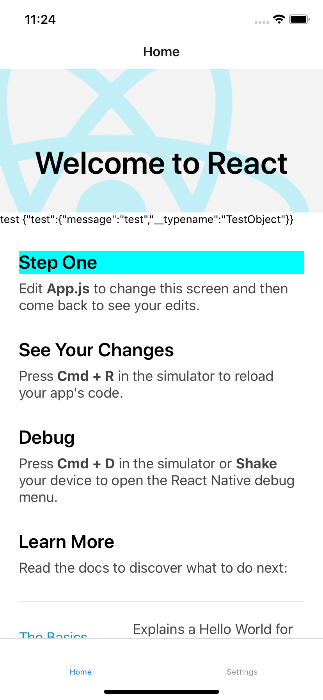

# bouncecode-react-native

[BounceCode CMS](https://github.com/bouncecode/bouncecode-cms) 와 함께 사용할 수 있습니다.

## 스플래시 이미지 수정

스플래시는 [react-native-splash-screen](https://github.com/crazycodeboy/react-native-splash-screen) 라이브러리를 사용하였습니다.

### Android

스플래시 이미지 경로의 파일을 수정하세요.

```
android/app/src/main/res/drawable/launch_screen.png
```

### iOS

스플래시 이미지 경로의 파일을 수정하세요.

```
ios/bouncecode/Images.xcassets/launch_screen.imageset/launch_screen.png
```

## 스크린샷


